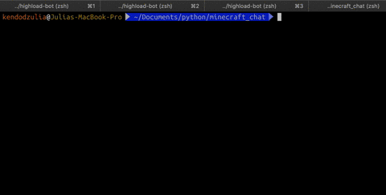
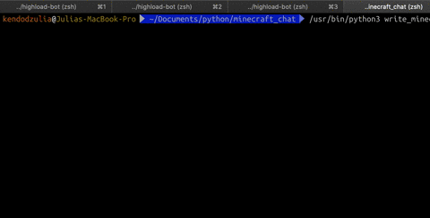

# Консольная утилита для работы с чатом

Утилита позволяет подключаться к чату minechat.dvmn.org, сохранять историю переписки, регистрироваться в чате и отправлять в него сообщения.

 | 


## Переменные окружения

`HOST` - адрес чата. По умолчанию `minechat.dvmn.org`.

`LISTENING_PORT` - порт для прослушивания сообщений чата. По умолчанию 5000.

`WRITING_PORT` - порт для отправки сообщений в чат. По умолчанию 5050.

`PATH_TO_HISTORY` - путь для записи истории сообщений чата. По умолчанию пустой (текущий каталог скрипта).

`ACCOUNT_HASH` - Токен пользователя. По умолчанию пустой токен (будет зарегистрирован новый пользователь).


## Как установить

Для работы утилиты нужен Python версии не ниже 3.6.

1. Заполнить переменные окружения.

2. Установить зависимости:

```bash
pip install -r requirements.txt
```


## Как запустить

Скрипт прослушивания чата запускают со следующими необязательными параметрами:
```--host```    Адрес чата.
```--port```    Порт для прослушивания сообщения чата.
```--history``` Путь для записи истории сообщений чата.

```bash
python3 listen_minechat.py --history history
```

Скрипт для регистрации в чате и отправки сообщений в чат запускают со следующими необязательными параметрами:
```--host```    Адрес чата.
```--port```    Порт для прослушивания сообщения чата.
```--hash```    Токен пользователя чата.
```--user```    Имя нового пользователя чата, запускает процесс регистрации.
```--message``` Сообщение, которое необходимо отправить в чат.

```bash
python3 write_minechat.py --user <Имя пользователя> --message <Сообщение в чат>
```


# Цели проекта

Код написан в учебных целях — это урок в курсе по Python и веб-разработке на сайте [Devman](https://dvmn.org).